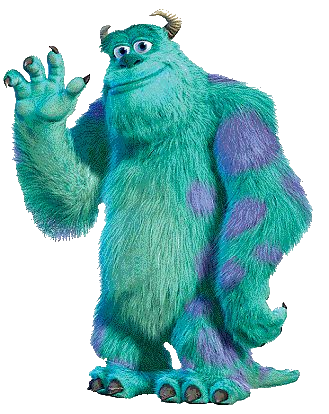

<!-- SLIDE -->
<!-- INVERTED -->

# Equipazgo

## Liderazgo sin egos

<!-- NOTES -->
Presentación sobre el concepto de equipazgo: liderazgo concurrente sin egos.

<!-- SLIDE -->

## Mánu Fosela

$COLUMNS$

$COL$

$COL$

Developer de base, líder por accidente... y por vocación.

Me di cuenta de que no quería ser jefe de nadie, pero sí quería acompañar, influir, cuidar.

De ahí nació mi manera de ver el liderazgo: **desde el afecto**.

$END$

<!-- NOTES -->
Presentación personal de Mánu Fosela, autor del concepto de liderazgo afectivo y equipazgo.

<!-- SLIDE -->

## Sobre el liderazgo

<!-- NOTES -->
- ¿Alguna vez habéis trabajado con un jefe que dirigía, pero no lideraba?
- ¿Alguna vez os habéis sentido solos liderando?

Vivimos en una sociedad donde quienes nos dirigen no nos lideran. Y quienes lideran, muchas veces lo hacen desde el ego

<!-- SUBSLIDE -->
<!-- INVERTED -->

El modelo del líder solitario ha fracasado.

<!-- SLIDE -->

## ¿Qué es el equipazgo?

<!-- NOTES -->

- Cuando trabajamos en equipo como developers, ¿cada uno hace lo suyo o nos coordinamos?
- ¿Qué pasa si alguien falta? ¿Su trabajo se queda sin hacer?
- ¿La idea del equipo es que cada uno tenga su parcela, o el código es de todos y seguimos unas reglas comunes?

- En un equipo técnico, si alguien deja su parte sin documentar, sin test, o sin explicar, ¿qué ocurre?
- ¿Y si alguien decide hacer las cosas ‘a su manera’, sin seguir las convenciones del equipo?
- ¿No genera más problemas que beneficios?

Igual que en el código tenemos convenciones, estándares y code reviews, en el liderazgo necesitamos lo mismo: coherencia, cuidado mutuo y propósito compartido.

El liderazgo tradicional pone a una persona sola decidiendo, enfrentada a todo… como si un solo developer pudiera llevar todo el backend, el frontend, los tests, los despliegues y además... ¡hacerlo perfecto!

Eso no escala. Nunca lo ha hecho. Por eso nace el equipazgo.

Equipazgo no es liderazgo compartido. Es liderazgo concurrente. Donde no hay parcelas, hay propósito común.

Donde no hay egos, hay generosidad directiva. Donde no hay jefes, hay referentes que se apoyan y se cubren.

Analogía:
Como dos padres que lideran una familia: sin competir, repartiéndose tareas según fortalezas, y poniendo siempre por delante a ‘los hijos’.

<!-- SUBSLIDE -->

¿Conocéis algún ejemplo de esto en vuestra empresa o entorno?

<!-- SLIDE -->

## Obstáculos reales al liderazgo sin ego

<!-- SUBSLIDE -->

### ¿Qué creeis que frena el liderazgo en vuestras empresas?

<!-- NOTES -->

Los egos que confrontan en lugar de colaborar.
La jerarquía mal entendida que impone en vez de guiar.
El miedo a perder poder.

<!-- SUBSLIDE -->
<!-- INVERTED -->

### Si no te gustan las personas, no lideres

<!-- SLIDE -->

## Claves de un equipazgo

<!-- SUBSLIDE -->

### ¿Qué cualidades creéis que deben tener quienes lideran juntos?

<!-- SUBSLIDE -->

### Mis claves de equipazgo

- **Afecto genuino**
- **Coherencia**
- **Humildad**
- **Escucha Activa**

<!-- NOTES -->
Las cuatro claves fundamentales para un equipazgo efectivo.

<!-- SLIDE -->

## Debate

<!-- NOTES -->
¿Qué barreras encontráis para aplicar el equipazgo?
¿Creéis que los líderes actuales están preparados para liderar desde la generosidad?
¿Qué pasaría si quitáramos los egos de las salas de dirección?
¿Cómo podríamos generar afecto genuino entre líderes hoy?
¿Habéis vivido la soledad del liderazgo? ¿Cómo la gestionasteis?

<!-- SLIDE -->
<!-- INVERTED -->

**"Liderar una empresa es dirigirla teniendo en cuenta las emociones de las personas que la conforman. Y para eso hay que liderar desde el afecto."**

<!-- SLIDE -->

## GRANCIAS

<!-- SLIDE -->

presen.tacion.es/equipazgo

$COLUMNS$

$COL$

**@manufosela**

manufosela.es

$COL$

**savvily.es**

$END$
